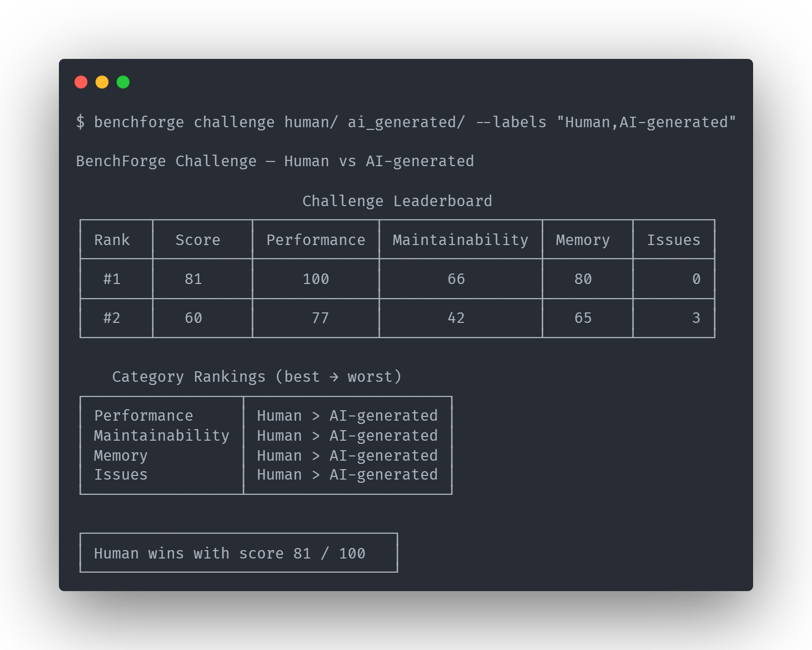
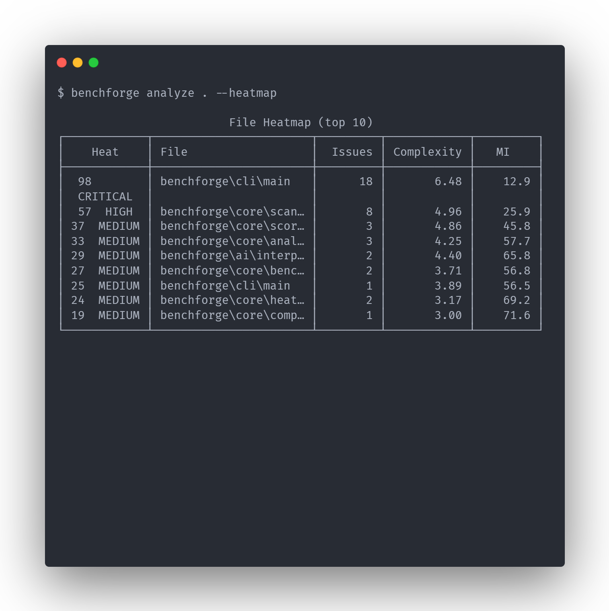
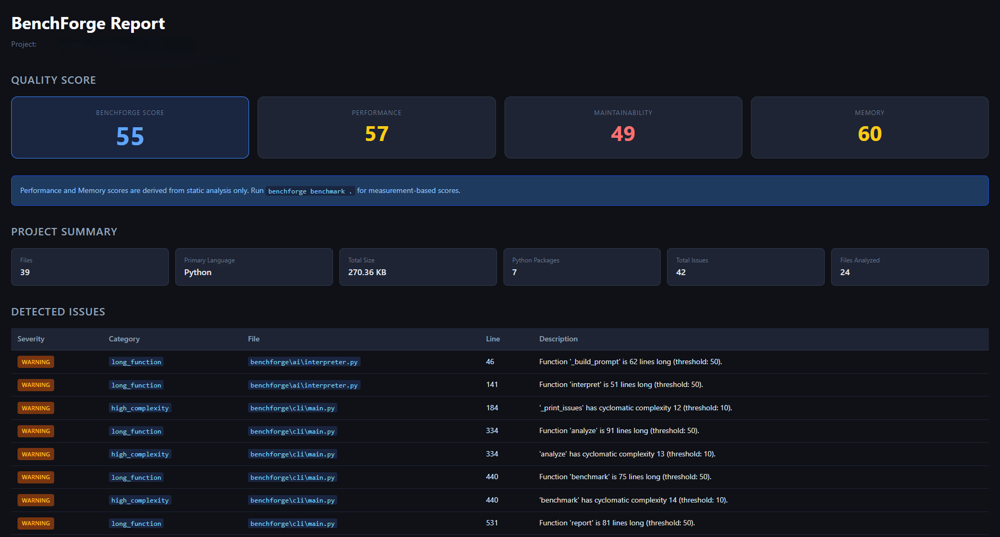
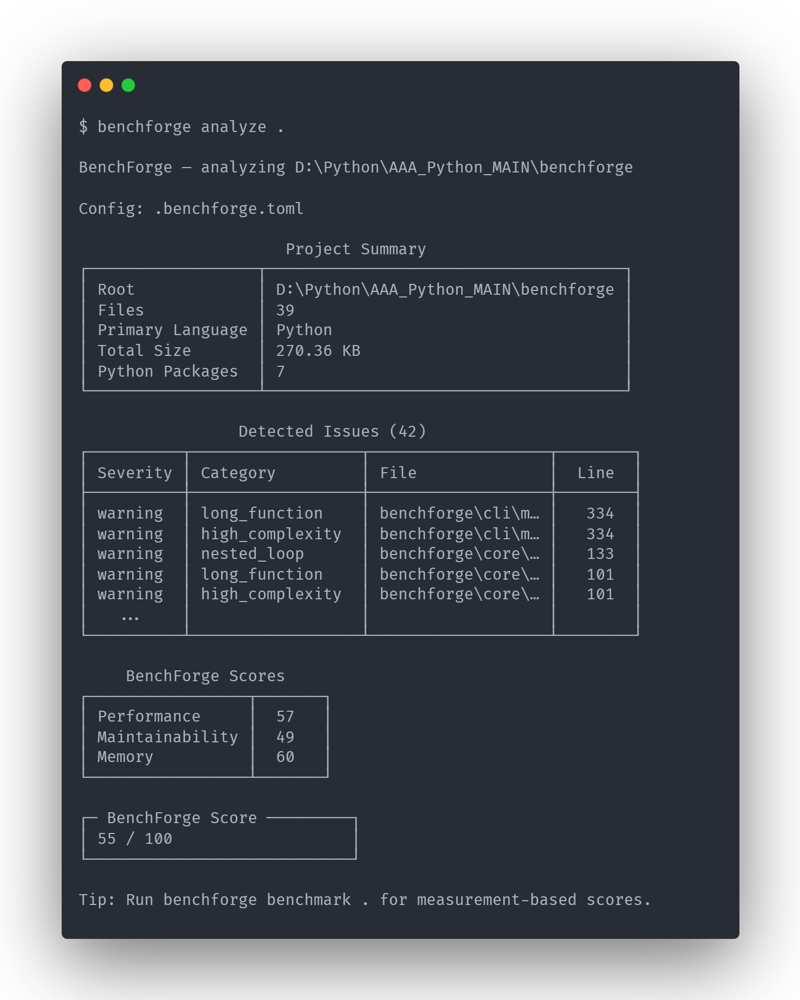

# BenchForge

**BenchForge** is a code quality and benchmarking tool built for the **AI coding era**.

It gives developers, especially **vibecoders**, fast and honest signal about their code:

> *What structural issues does this code have, and where should I look first?*

BenchForge scans your project, finds structural problems with static analysis, can measure runtime and memory, and produces a **score with a breakdown of what drove it**.

## Start Here

- Want the full scoring methodology? See [`docs/scoring.md`](docs/scoring.md).
- For CI setup examples, see [`docs/ci_integration.md`](docs/ci_integration.md).
- For product and design principles, see [`docs/design_rulebook.md`](docs/design_rulebook.md).
- For project direction, see [`docs/roadmap.md`](docs/roadmap.md).
- Want to add a language plugin? See [`docs/plugin_guide.md`](docs/plugin_guide.md).

## What BenchForge Is

- A **signal tool** that helps you spot risky code faster
- A **comparison tool** that helps you compare one implementation to another
- A **regression guard** that helps you catch quality drops in a PR
- A **starting point for review** with file and line pointers

## What BenchForge Is Not

- Not a replacement for **code review**
- Not a replacement for **profiling** real workloads
- Not proof that code is **correct**
- Not a final verdict on whether code is "good" or "bad"

BenchForge helps you **prioritize where to look first**. It does not make the final judgment for you.

## Why BenchForge Exists

AI can generate code faster than humans can review it.

That creates a new problem: code may run, look tidy, and still be slow, hard to maintain, or structurally fragile. BenchForge gives you a fast first pass so you can review with better context instead of trusting vibes or a single number. BenchForge is especially useful when comparing human-written and AI-generated implementations.

## AI vs Human Code Challenge

BenchForge can compare multiple implementations of the same problem side by side.

```bash
benchforge challenge human/ ai_generated/ --labels "Human,AI-generated"
```



BenchForge helps you objectively evaluate AI-generated code instead of relying on intuition.

For product and design principles, see [`docs/design_rulebook.md`](docs/design_rulebook.md).

## What You Get After Running BenchForge

When you run BenchForge, you typically get:

- a **BenchForge Score** and the three sub-scores behind it
- an **issue breakdown** showing what was detected
- **file and line pointers** so you know where to inspect
- optional **heatmap**, **HTML report**, **badge**, and **CI signals**

That makes it easier to answer: "What should I review first?"

## Installation

```bash
pip install benchforge
```

## Quick Start

```bash
# Analyze a project
benchforge analyze .

# Run performance benchmarks
benchforge benchmark .

# Generate an HTML report
benchforge report .

# Generate an SVG badge
benchforge badge .

# Show file heatmap
benchforge analyze . --heatmap

# JSON output (for scripts / CI)
benchforge analyze . --format json
```



## Why BenchForge Turns Findings Into a Score

Large projects can produce a lot of findings. A score helps compress that into a quick signal:

- to compare two versions of the same project
- to notice when a PR made things worse
- to decide where to spend review time first

What the score is **not**:

- not a scientific universal truth
- not a replacement for reading the issue list
- not a reason to skip profiling or testing

Treat the score as a **starting point for review**, not a final judgment.

Want the full scoring methodology? See [`docs/scoring.md`](docs/scoring.md).

## How Scoring Works

BenchForge builds one final score from three sub-scores:

| Sub-score | What it looks at |
|---|---|
| Performance | Loop patterns, complexity, or measured runtime |
| Maintainability | How hard the code is likely to understand and change |
| Memory | Measured memory use, or a conservative risk signal when no benchmark exists |

Simple version:

1. BenchForge runs deterministic rules on your code.
2. It computes **Performance**, **Maintainability**, and **Memory**.
3. It combines them into one final **BenchForge Score**.

Important:

- the score comes from **deterministic rules**
- the same codebase should get the same score
- optional AI commentary **does not change the score**

Want the full scoring methodology? See [`docs/scoring.md`](docs/scoring.md).

## Beginner Terms, In Plain English

- **Benchmark**: a controlled test run that measures how long code takes and how much memory it uses
- **Static analysis**: reading code without running it, to look for patterns and risks
- **Maintainability**: how easy code is to understand, change, and debug later
- **Cyclomatic complexity**: a rough measure of how many branches and decision paths a function has
- **Nested loop**: a loop inside another loop
- **O(n^2)**: work that grows very fast because for every item, you loop over many items again

Want the detailed scoring reference and thresholds? See [`docs/scoring.md`](docs/scoring.md).

## Why Nested Loops Matter

A nested loop is not always bad, but it often deserves a quick look.

```python
for user in users:
    for order in orders:
        if order.user_id == user.id:
            ...
```

If `users` grows from 100 to 1,000 and `orders` grows too, the total work can grow a lot because the inner loop runs again for every outer item. That is why patterns like this can slow down as data gets bigger.

BenchForge flags these patterns as a **risk signal**, then you decide whether they are fine in context.

Want the exact nested-loop rules and exceptions? See [`docs/scoring.md`](docs/scoring.md).

## Memory Scoring, Honestly

BenchForge handles memory in two different ways:

- With benchmark data: the memory score can use **measured memory usage**
- Without benchmark data: the memory score is only a **proxy / risk signal**

So if you have not run `benchforge benchmark .`, the memory score is helpful but limited. It is not claiming precise memory measurement from static analysis alone.

Want the detailed memory methodology? See [`docs/scoring.md`](docs/scoring.md).

## Commands

| Command | Description |
|---|---|
| `benchforge analyze PATH` | Static analysis + scoring |
| `benchforge benchmark PATH` | Runtime and memory benchmarking |
| `benchforge report PATH` | Full pipeline + HTML report |
| `benchforge badge PATH` | Generate an SVG badge for the current score |
| `benchforge compare PATH_A PATH_B` | Side-by-side comparison of two projects |
| `benchforge challenge PATH...` | Ranked leaderboard for N implementations |
| `benchforge roast PATH` | Fun but honest code insights |
| `benchforge ci PATH` | CI quality gate (exits 1 when score < threshold) |
| `benchforge pr-guard PATH` | PR regression check (exits 1 when score dropped too much) |

The `report` command runs the full pipeline and generates an HTML report:

```bash
benchforge report .
```



### `analyze`

```bash
benchforge analyze .                        # text output
benchforge analyze . --format json          # JSON output
benchforge analyze . --heatmap              # show file heatmap
benchforge analyze . --heatmap --top 20     # top 20 hottest files
benchforge analyze . --show-test-issues     # include test file issues (hidden by default)
benchforge analyze . --ai                   # add AI insight (requires MISTRAL_API_KEY)
```

### `badge`

```bash
benchforge badge .
benchforge badge . --output badge.svg
benchforge badge . --style plastic
benchforge badge . --label "code quality"
benchforge badge . --format json
```

### `compare`

```bash
benchforge compare human/ ai_generated/
benchforge compare human/ ai/ --label-a "Human" --label-b "GPT-4"
benchforge compare human/ ai/ --format json
```

### `challenge`

```bash
benchforge challenge impl_a/ impl_b/ impl_c/
benchforge challenge impl_a/ impl_b/ --labels "Human,Claude"
benchforge challenge impl_a/ impl_b/ --format json
```

### `roast`

```bash
benchforge roast .
benchforge roast . --ai          # AI commentary (requires MISTRAL_API_KEY)
benchforge roast . --seed 42     # reproducible output
```

### `ci`

```bash
benchforge ci .                         # threshold from .benchforge.toml (default 60)
benchforge ci . --min-score 75          # custom threshold
benchforge ci . --format json           # JSON output for GitHub Actions / GitLab CI
```

Configure in `.benchforge.toml`:

```toml
[ci]
min_score = 70
```

For CI setup examples, see [`docs/ci_integration.md`](docs/ci_integration.md).

### `pr-guard`

```bash
# On the base branch - save baseline
benchforge pr-guard . --save-baseline

# On the PR branch - check for regression
benchforge pr-guard . --max-drop 5
benchforge pr-guard . --max-drop 5 --format json
```

For CI setup examples, see [`docs/ci_integration.md`](docs/ci_integration.md).

## Example Output



## Configuration

Create `.benchforge.toml` in your project root to customize scoring and scope:

```toml
[scope]
exclude = ["tests/**", "dist/**"]
# include = ["src/**"]

[scoring.weights]
performance     = 0.40
maintainability = 0.35
memory          = 0.25

[scoring.penalties]
nested_loop     = 10.0
long_function   = 5.0

[ci]
min_score = 70
```

Default scope excludes common non-production paths such as `tests/**` and `*.egg-info/**`.

**When should you add a `.benchforge.toml`?**

The default thresholds work well for general Python libraries. For other project types, tuning helps:

- **CLI tools**: command handlers are often longer and branch-heavy
- **Data pipelines**: nested iteration can be structural, not algorithmic
- **Frameworks / engines**: high complexity may be part of the architecture

Want the full scoring and scope reference? See [`docs/scoring.md`](docs/scoring.md).

> **Windows / encoding note:** BenchForge reads Python files as UTF-8 with BOM stripping (`utf-8-sig`). Files saved as "UTF-8 with BOM" by some editors are handled correctly and will not produce false parse errors.

## CI / CD Integration

Use BenchForge in CI when you want a quality gate or regression signal in pull requests.

For CI setup examples, see [`docs/ci_integration.md`](docs/ci_integration.md).

Quick example:

```yaml
- name: BenchForge quality gate
  run: benchforge ci . --min-score 70 --format json
```

## Philosophy

**Signal over verdict.**
BenchForge gives you data to investigate, not a grade to argue with. A score of 55 on a large CLI tool and a score of 55 on a small utility library mean very different things. The issue list and the breakdown are usually more useful than the number alone.

**Deterministic before AI.**
Every score is computed from rules you can inspect. AI interpretation, when enabled, adds commentary on top. It never changes the score.

**Honest about limitations.**
Static analysis cannot execute your code, infer full intent, or understand every project-specific tradeoff. BenchForge tells you what it can see, not what it can guarantee.

For product and design principles, see [`docs/design_rulebook.md`](docs/design_rulebook.md).

## Limitations

BenchForge uses static AST analysis, which means it reads code without executing it.

What that means in practice:

- it can produce **false positives**
- it cannot prove **runtime behavior**
- it cannot prove **correctness**
- it should not replace **profiling** when performance really matters

For runtime performance, use `benchforge benchmark .` to add actual measurement data to the score.

For the detailed methodology and detector behavior, see [`docs/scoring.md`](docs/scoring.md).

## AI Insight (optional)

The `--ai` flag sends analysis metadata such as scores, issue counts, and file names to Mistral AI for a plain-language interpretation. No source code is transmitted, only structured analysis results.

The AI output adds observations and suggestions. It does not override or improve the deterministic score.

**Setup, one time per session:**

```bash
export MISTRAL_API_KEY=your_key_here   # Linux / macOS
set MISTRAL_API_KEY=your_key_here      # Windows CMD
$env:MISTRAL_API_KEY="your_key_here"   # Windows PowerShell
```

**Setup, persistent:**

Create a `.env` file in the project root:

```text
MISTRAL_API_KEY=your_key_here
```

On Windows PowerShell, load it with the included helper:

```powershell
. .\load_env.ps1
```

Get a free API key at [console.mistral.ai](https://console.mistral.ai). The tool works fully without it.

## Roadmap

For project direction and upcoming work, see [`docs/roadmap.md`](docs/roadmap.md).

## Community

BenchForge is a **community-driven tool**.

We welcome:

- contributors
- benchmark scenarios
- plugins
- optimization experiments

The goal is to build a shared toolkit for **AI-assisted development workflows**.

## Contributing

Contributions are welcome. See `CONTRIBUTING.md` for guidelines.

Areas where help is especially valuable:

- scoring improvements and threshold research
- language support beyond Python
- benchmarking strategies
- developer UX and output readability

Want to add support for a new language? The plugin architecture is already in place. See [`docs/plugin_guide.md`](docs/plugin_guide.md) for the protocol, a step-by-step walkthrough, and an honest description of what is wired up vs. what still needs work.

## License

MIT License

## The AI Coding Era Needs Better Tools

BenchForge exists to help vibecoders and developers **trust their code again**, even when AI helped write it.
